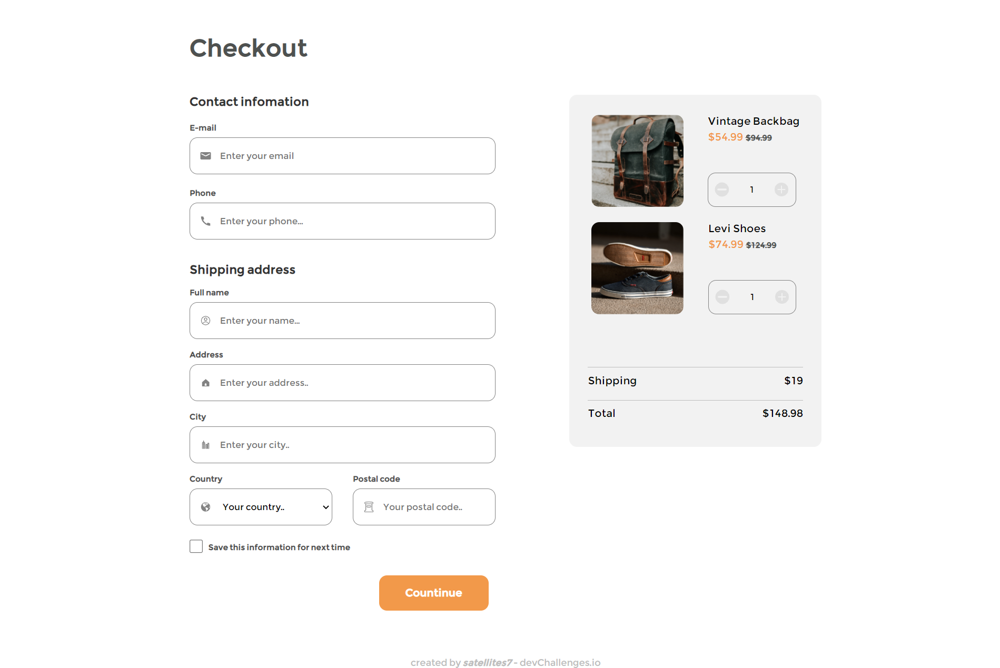
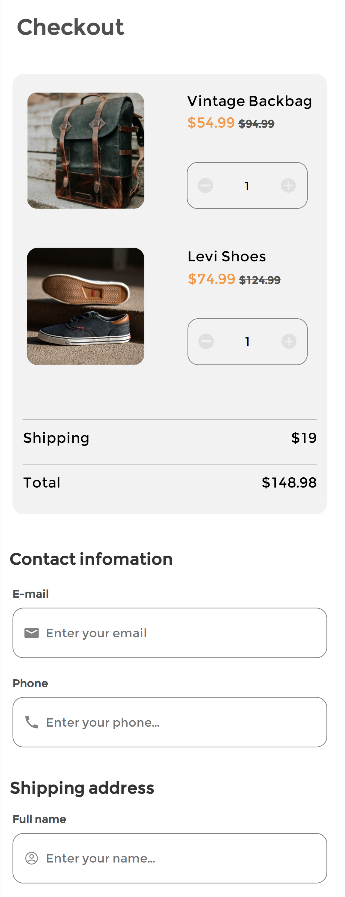
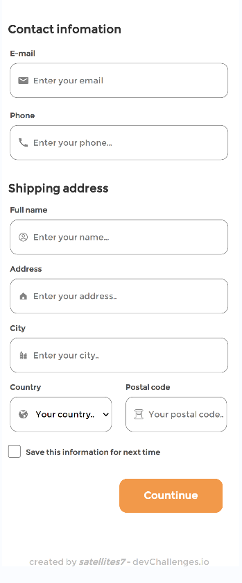

<!-- Please update value in the {}  -->

<h1 align="center">checkout-page</h1>

   Solution for a challenge from  <a href="http://devchallenges.io" target="_blank">Devchallenges.io</a>.

  <h3>
    <a href="https://checkout-page.onrender.com">
      Demo
    </a>
     | 
    <a href="https://{your-url-to-the-solution}">
      Solution
    </a>
     | 
    <a href="https://devchallenges.io/challenges/0J1NxxGhOUYVqihwegfO">
      Challenge
    </a>
  </h3>

## Overview

### Built With

<!-- This section should list any major frameworks that you built your project using. Here are a few examples.-->
Html , Css
