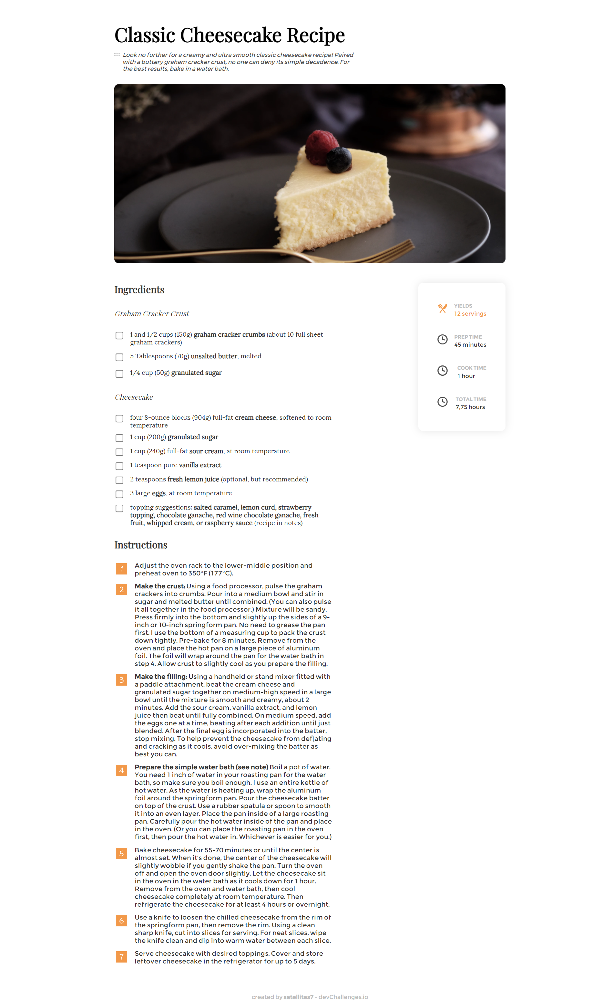
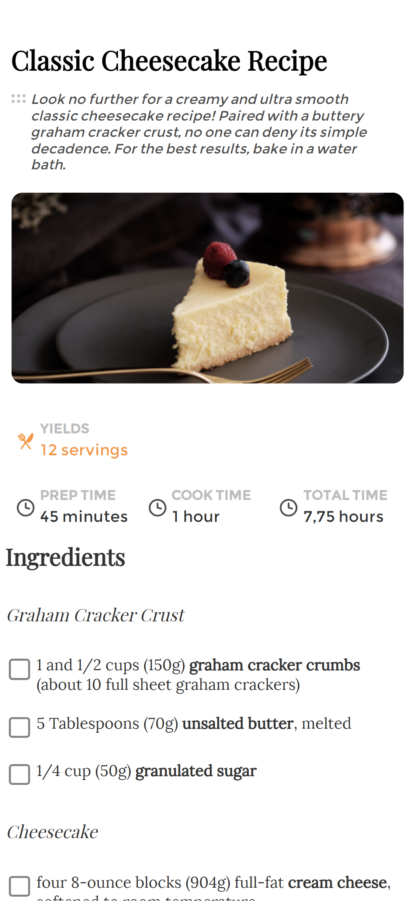
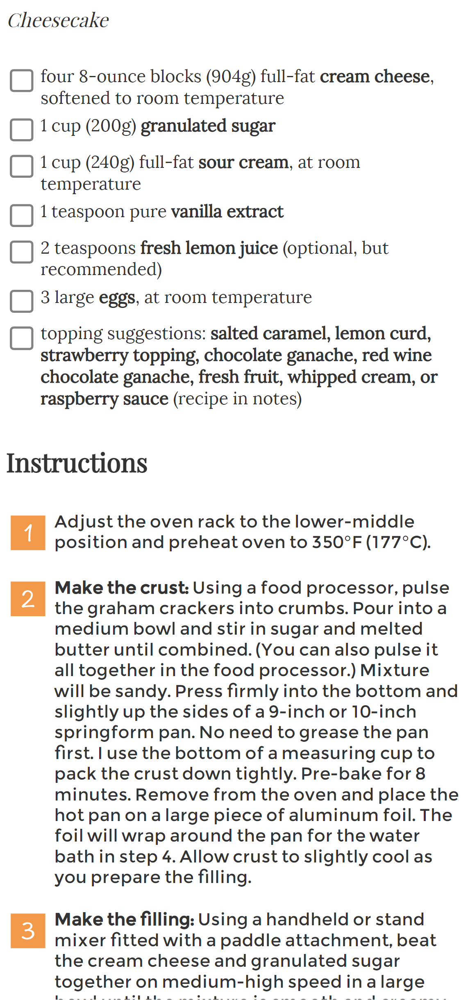

<!-- Please update value in the {}  -->

<h1 align="center">recipe-page-master</h1>

   Solution for a challenge from  <a href="http://devchallenges.io" target="_blank">Devchallenges.io</a>.

  <h3>
    <a href="https://recipe-page-mfzw.onrender.com">
      Demo
    </a>
     | 
    <a href="https://github.com/satellites7/Responsive-Web-Developer/edit/main/recipe-page-master">
      Solution
    </a>
     | 
    <a href="https://{your-url-to-the-challenge}">
      Challenge
    </a>
  </h3>

<!-- TABLE OF CONTENTS -->

<!-- OVERVIEW -->

## Overview

### Built With

<!-- This section should list any major frameworks that you built your project using. Here are a few examples.-->

- html css

