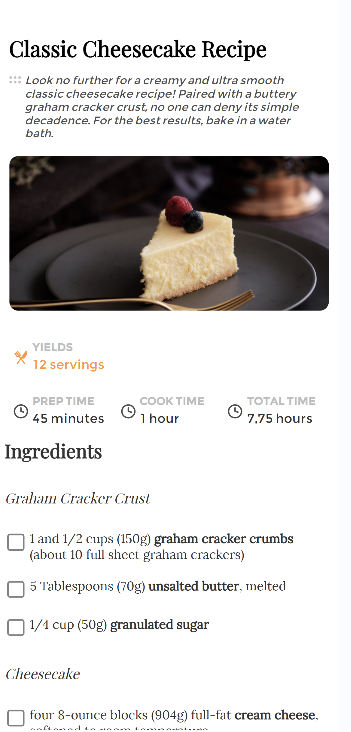

<!-- Please update value in the {}  -->

<h1 align="center">recipe-page-master</h1>

<div align="center">
   Solution for a challenge from  <a href="http://devchallenges.io" target="_blank">Devchallenges.io</a>.
</div>

<div align="center">
  <h3>
    <a href="https://recipe-page-mfzw.onrender.com">
      Demo
    </a>
    <span> | </span>
    <a href="https://github.com/satellites7/Responsive-Web-Developer/edit/main/recipe-page-master">
      Solution
    </a>
    <span> | </span>
    <a href="https://{your-url-to-the-challenge}">
      Challenge
    </a>
  </h3>
</div>

<!-- TABLE OF CONTENTS -->

## Table of Contents

- [Overview](#overview)
  - [Built With](#built-with)
- [Features](#features)
- [How to use](#how-to-use)
- [Contact](#contact)
- [Acknowledgements](#acknowledgements)

<!-- OVERVIEW -->

## Overview





Introduce your projects by taking a screenshot or a gif. Try to tell visitors a story about your project by answering:

- Where can I see your demo?
- What was your experience?
- What have you learned/improved?
- Your wisdom? :)

### Built With

<!-- This section should list any major frameworks that you built your project using. Here are a few examples.-->

- html css

## Features

<!-- List the features of your application or follow the template. Don't share the figma file here :) -->

```bash

```

## Acknowledgements

<!-- This section should list any articles or add-ons/plugins that helps you to complete the project. This is optional but it will help you in the future. For exmpale -->

- 

## Contact

- Website [your-website.com](https://{your-web-site-link})
- GitHub [@satellites7](https://github.com/satellites7)
- Twitter [@your-twitter](https://{twitter.com/your-username})
